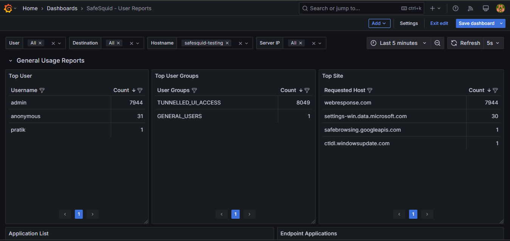
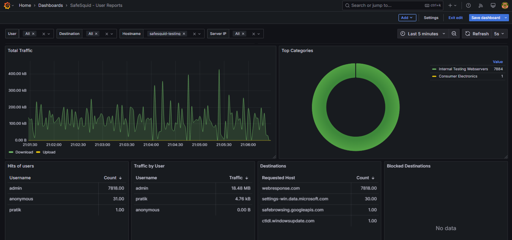
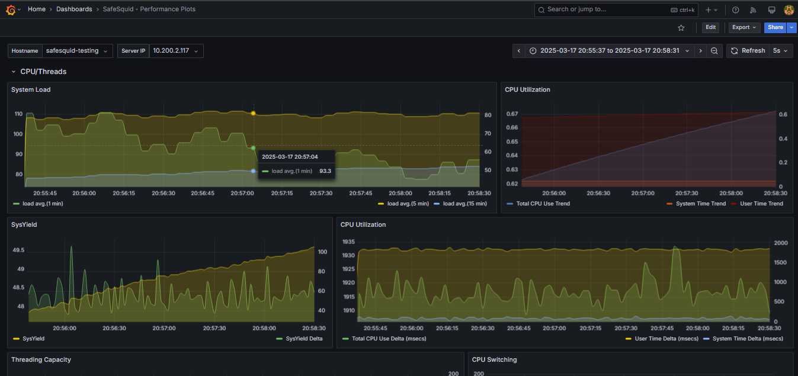
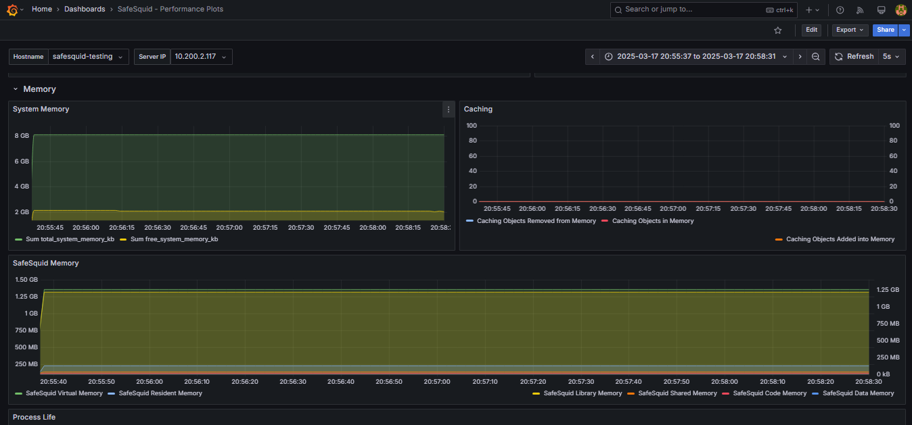
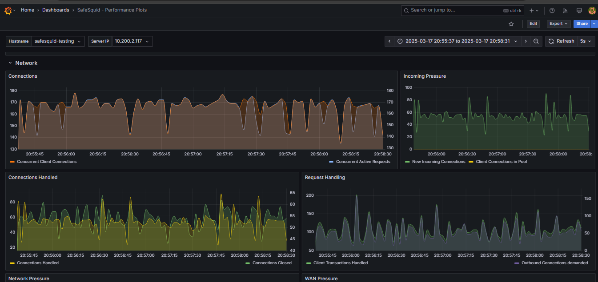
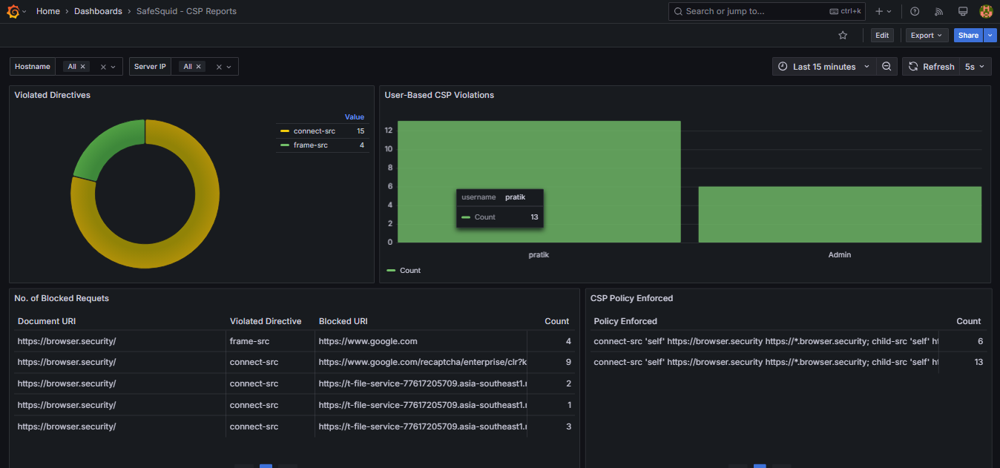

# SafeSquid-ELG-Reporting Setup Script

This repository contains a setup script to install and configure Elasticsearch, Logstash, and Grafana for SafeSquid-ELG-Reporting.

## Prerequisites

Before running the setup script, ensure you have the following:

- Ubuntu 24.04 LTS
- System Requirements: 8 CPUs & 12GB
- Minimum storage size: 250 GB  
- Ensure that you are a root user.
- Internet connection

## Usage

1. Clone the repository:

    ```sh
    git clone https://github.com/SafeSquid-Github/SafeSquid-ELG-Reporting
    cd SafeSquid-ELG-Reporting
    ```

2. Run the setup script:

    ```sh
    bash setup.sh
    ```
## Proxy Setup

To set up the proxy, you can use the following one-liner to download and execute the proxy setup script:

### What the Proxy Setup Script Does

The proxy setup script performs the following actions:

1. Downloads the necessary configuration files.
2. Prompts the user for the IP address of the Logstash server.
3. Configures rsyslog to forward logs to the specified Logstash server via UDP on port 10514 (default).

### Running the Proxy Setup Script

When you run the proxy setup script, you will be prompted to enter the IP address of your Logstash server. The default port used for forwarding logs is 10514. If you do not specify a port, the script will use the default port.

usage:

```sh
curl -s https://raw.githubusercontent.com/SafeSquid-Github/SafeSquid-ELG-Reporting/refs/heads/main/proxy-setup.sh -O
bash proxy-setup.sh
```

During the execution, you will be asked to provide the Logstash server IP address. The script will then configure rsyslog to forward logs to the specified server using UDP on port 10514.

## What the Script Does

- Updates the system packages.
- Installs necessary dependencies.
- Adds the Elasticsearch and Grafana repositories.
- Installs Elasticsearch, Logstash, and Grafana.
- Sets up Logstash configuration.
- Imports predefined Grafana dashboards.
- Updates rsyslog configuration of your proxy server.

## Default Credentials

- **Grafana**: 
  - Username: `admin`
  - Password: `admin`

It is recommended to change the default password after the first login for security reasons.

## Dashboard Previews

### User Reports Dashboard



### Performance Plots Dashboard




### Content Security Policy Dashboard



